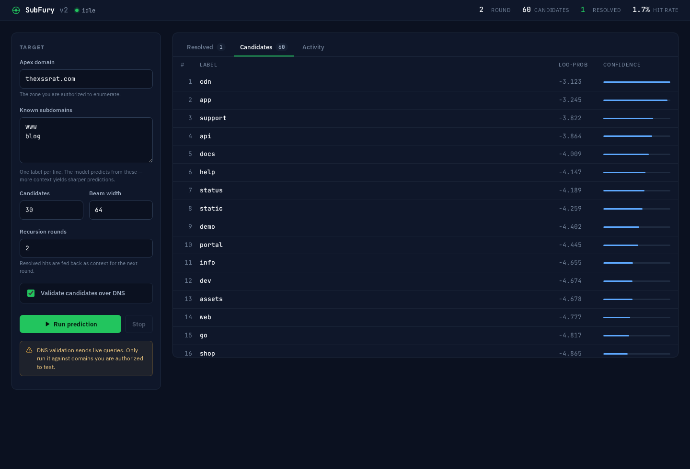

<div align="center">
  

  <h1>SubFury v2</h1>

  <p><b>A purpose-built transformer that predicts an organization's subdomains
  from the ones you already know.</b></p>

  <p>
    
    
    
  </p>
</div>

---

SubFury generates candidate subdomains **conditioned on the subdomains you have
already discovered**, ranks them by probability with beam search, validates them
over live DNS, then feeds confirmed hits back as context and runs again.

Organizations name infrastructure consistently. A host called `inventory` makes
`inventoryapp` likely; `grafana` makes `prometheus` likely. That per-organization
signal is what a static wordlist structurally cannot capture — and it is the
entire basis of this tool.

> [!WARNING]
> DNS validation sends live queries. Only run it against domains you are
> authorized to test.

---

## Results

Held-out evaluation on **885 real apex domains** the model never saw. For each,
half its hostnames are shown to the model and the other half withheld as ground
truth. Both methods get the same candidate budget; no DNS is involved.

| Budget | SubFury v2 | n0kovo wordlist | Improvement |
|-------:|-----------:|----------------:|------------:|
| N=25   | **0.174**  | 0.030           | **+482%**   |
| N=50   | **0.210**  | 0.058           | **+264%**   |
| N=100  | **0.224**  | 0.086           | **+160%**   |
| N=200  | **0.223**  | 0.122           | **+83%**    |

The margin is widest at **small N** — exactly the regime that matters when your
DNS query budget is the constraint. Reproduce with `python subfury_v2/evaluate.py -n 100`.

**Live example.** Seeded with only `www` and `blog` on a real domain, round 1
found `shop`; that hit became context and round 2 found `learn`.

---

## Web UI

```bash
python webui/app.py     # → http://127.0.0.1:8000
```

Streams the pipeline over Server-Sent Events: candidates appear ranked by
log-probability as they are generated, DNS hits land as they resolve, and the
activity log records every stage.

<div align="center">
  
</div>

---

## CLI

```bash
pip install -r requirements.txt
pip install torch --index-url https://download.pytorch.org/whl/cu126   # or cpu

# predict + validate against an authorized target
python subfury_v2/predict.py example.com --known known.txt -n 200

# model output only, no DNS traffic
python subfury_v2/predict.py example.com --known known.txt -n 200 --no-resolve

# inspect the mechanism: tokens, conditioned prefix, beam scores
python subfury_v2/explain.py --known api,dev,staging
```

`--known` accepts bare labels (`api`) or FQDNs (`api.example.com`), one per line.

| Flag | Default | Purpose |
|---|---|---|
| `-n, --topn` | 100 | candidates generated per round |
| `--num-beams` | 64 | beam width — higher is slower, more thorough |
| `--max-recursion` | 3 | rounds of feeding resolved hits back as context |
| `--no-resolve` | off | skip DNS entirely; print raw model output |

---

## How it works

```
known labels  ──►  BPE  ──►  api [SEP] dev [SEP] staging [DELIM]
                                                      │
                                          beam search │ ranked by log-prob
                                                      ▼
                                     app · support · docs · cdn · status …
                                                      │
                                       concurrent DNS │ A-record lookups
                                                      ▼
                                          resolved hits ──┐
                                                          │ appended to
                                          ◄───────────────┘ known set
```

**1. Tokenize.** A BPE trained *only* on subdomain data keeps real units whole —
`api`, `staging`, `mail`, `prod`, `vpn` are each a single token. A generic English
BPE fragments them, which is what made v1's DistilGPT-2 the wrong tool.

**2. Condition.** Known labels are joined with `[SEP]` and terminated by `[DELIM]`,
which means *"the known set ends here — now name a new member."* During training
the loss applies **only to tokens after `[DELIM]`**, so the model is never rewarded
for repeating its input, only for inferring what is missing.

**3. Beam search.** Deterministic, not sampled: you want the *N most probable*
labels to spend a finite DNS budget on, not diverse ones. Already-known and
syntactically invalid labels are dropped.

**4. Resolve and recurse.** Surviving candidates are resolved concurrently, and
confirmed hits rejoin the known set for the next round with strictly better context.

### Is it really conditioning, or replaying a global list?

Measured, because the whole design rests on it. Jaccard overlap between top-50
prediction sets from different seed types:

|          | dev  | infra | ecom | monitor |
|----------|-----:|------:|-----:|--------:|
| **dev**     | 1.00 | 0.35 | 0.59 | **0.18** |
| **monitor** | 0.18 | 0.43 | 0.20 | 1.00 |

A dev seed and a monitoring seed share only **18%** of their predictions.
Against a generic prior, **28–66% of predictions are seed-driven** — the remainder
being names that genuinely are common everywhere.

---

## Training your own model

```bash
# 0. fetch the baseline wordlist (used by evaluate.py) into data/
curl -Lo data/subdomains_tiny.txt \
  https://raw.githubusercontent.com/n0kovo/n0kovo_subdomains/main/n0kovo_subdomains_tiny.txt

# 1. apex-grouped hostnames from the Common Crawl host-level webgraph
#    (drop vertex part files into data/cc/ first)
python subfury_v2/data_prep.py

# 2. domain-specific BPE
python subfury_v2/tokenizer_train.py

# 3. train  (~3 min for 4 epochs on an RTX 4060)
python subfury_v2/train.py --epochs 4

# 4. measure against the wordlist baseline
python subfury_v2/evaluate.py -n 100
```

The shipped model was trained on **84,144 apex groups / ~1.04M hostnames**.
Training re-samples which labels are "known" versus "target" every epoch, so one
apex group yields many distinct supervision pairs.

---

## Model

| | |
|---|---|
| Architecture | nanoGPT-style causal decoder (pre-LN, SDPA attention, weight-tied head) |
| Size | 6 layers · 6 heads · `n_embd` 300 · `block_size` 192 → **7.8M params** |
| Tokenizer | BPE, 4096 vocab, trained on subdomain labels |
| Objective | next-label prediction conditioned on a label set; loss on target only |
| Training | AdamW, cosine schedule + warmup, bf16 autocast, dropout 0.1 |

Every choice — from-scratch over fine-tuning, decoder-only over encoder-decoder,
domain BPE over character-level, and the parameter count — is justified against
current literature and tooling in **[MODEL_SELECTION.md](MODEL_SELECTION.md)**.

### Known limitation

Training data is the Common Crawl **web** graph: crawlable public sites. Internal
infrastructure hostnames are underrepresented by construction, so infra-flavored
seeds drift toward generic web labels. Training on passive DNS or Certificate
Transparency logs would fix this and is the highest-value next step.

---

## What changed from v1

v1 fine-tuned DistilGPT-2 on a flat wordlist and sampled blindly.

| v1 | v2 |
|---|---|
| Blind generation from a global wordlist | Set-conditioned on the target's known subdomains |
| DistilGPT-2, 82M, English BPE | Purpose-built 7.8M decoder + subdomain BPE |
| Temperature sampling | Deterministic beam search |
| "RL" = retrain on resolved hits | Recursive inference over a growing known set |
| No evaluation | recall@N on held-out real hostnames vs a baseline |
| Hardcoded W&B API key | Credentials read from the environment |

The original notebook and its scripts are preserved under `legacy/`.

---

## Layout

```
subfury_v2/     data_prep · tokenizer_train · model · train · predict · evaluate · explain
webui/          FastAPI backend + streaming single-page UI
legacy/         v1 DistilGPT-2 scripts, kept for reference
data/           wordlists, Common Crawl parts, generated apex groups
results/        tokenizer + checkpoints
```

## License

MIT.
