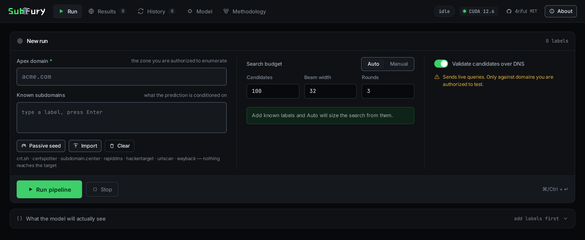

<div align="center">
  

  <h1>SubFury</h1>

  <p><b>A purpose-built transformer that predicts an organization's subdomains
  from the ones you already know.</b></p>

  <p>
    
    
    
    
  </p>
</div>

---

SubFury generates candidate subdomains **conditioned on the subdomains you have
already discovered**, ranks them by probability with beam search, validates them
over live DNS, then feeds resolving names back as context and runs again.

**Current scope:** the CLI and web UI run the beam-search predictor. The
retrieval experiments below are offline research artifacts, not the live
ranker. The operator workflow proposed below is a design for future work;
budgeted wildcard-aware DNS evidence is implemented, while source-aware
scheduling and service classification are not.

Organizations name infrastructure consistently, and a static wordlist — the same
list fired at every target — cannot use that. Whether this model actually uses it
is measured rather than asserted: conditioning it on a *different* organization's
labels collapses recall@100 from 0.288 to 0.059 on the same targets
(`results/research/swap.json`, 100 apexes). How far that conditioning goes, and
where the model stops beating a plain frequency prior, are both below.

> [!WARNING]
> DNS validation sends live queries. Only run it against domains you are
> authorized to test.

---

## Results

Every number below comes from an artifact under `results/research/`, produced by
`research/harness.py`: one shared split, one protocol, every method scored on
exactly the same cases.

**Protocol.** `data/groups_test.jsonl` holds 885 held-out apexes the model never
saw; the **545** with at least 6 labels are used, so a known/target split is
meaningful — **4,839 held-out labels**, mean 8.5 known and 8.9 withheld per apex.
Each apex's labels are split ~50/50 into a known set shown to the ranker and a
withheld set used as ground truth, by an RNG seeded from `sha256("1337:<apex>")`,
so the split does not depend on apex ordering, on filtering, or on which methods
are being run. Every method gets the same candidate budget N. No DNS, no network.

### recall@N — every method, one split

`results/research/baselines.json`. Mean per-apex recall; brackets are
percentile-bootstrap 95% CIs over apexes, 2,000 resamples.

```
method                                     recall@10             recall@25             recall@50            recall@100            recall@200       MAP  apex hit@max
--------------------------------------------------------------------------------------------------------------------------------------------------------------------
wordlist:subdomains_tiny.txt       0.018 [0.013,0.024]     0.027 [0.021,0.034]     0.058 [0.048,0.069]     0.097 [0.084,0.112]     0.138 [0.124,0.154]    0.0083       284/545
frequency-prior                    0.052 [0.042,0.062]     0.100 [0.084,0.118]     0.134 [0.116,0.153]     0.179 [0.158,0.202]     0.236 [0.212,0.262]    0.0361       306/545
markov-3gram                       0.029 [0.023,0.035]     0.047 [0.038,0.057]     0.073 [0.060,0.087]     0.117 [0.100,0.137]     0.145 [0.125,0.169]    0.0202       200/545
markov-4gram                       0.059 [0.048,0.070]     0.090 [0.075,0.107]     0.122 [0.104,0.143]     0.154 [0.134,0.176]     0.194 [0.171,0.220]    0.0356       256/545
markov-5gram                       0.057 [0.046,0.068]     0.098 [0.082,0.116]     0.132 [0.113,0.152]     0.175 [0.154,0.199]     0.224 [0.200,0.250]    0.0369       296/545
subfury-beam                       0.114 [0.095,0.134]     0.172 [0.148,0.196]     0.207 [0.182,0.235]     0.216 [0.190,0.244]     0.217 [0.192,0.244]    0.0968       264/545
```

`frequency-prior` is the baseline that matters: the training-split label
frequency ranking, same data as the model, zero parameters. The n0kovo wordlist
is the weakest control on the board — earlier versions of this README headlined
`recall@100 0.220 vs 0.097` against it, which flattered the model. Against that
wordlist, every method here looks good.

### The result is budget-dependent — and that is the finding

Paired bootstrap of each method minus the frequency prior on the same apexes,
2,000 resamples (`paired_vs_frequency_prior` in the same artifact):

```
paired bootstrap: method minus frequency-prior (same apexes, 2000 resamples)
method                                          Δ@10                      Δ@25                      Δ@50                     Δ@100                     Δ@200
wordlist:subdomains_tiny.txt   -0.034 [-0.044,-0.023]*   -0.073 [-0.090,-0.057]*   -0.076 [-0.095,-0.059]*   -0.081 [-0.101,-0.064]*   -0.098 [-0.119,-0.079]*
markov-3gram                 -0.023 [-0.031,-0.016]*   -0.053 [-0.066,-0.041]*   -0.061 [-0.073,-0.049]*   -0.062 [-0.076,-0.049]*   -0.091 [-0.105,-0.077]*
markov-4gram                 +0.007 [+0.002,+0.011]*   -0.010 [-0.016,-0.005]*   -0.012 [-0.019,-0.005]*   -0.025 [-0.035,-0.015]*   -0.042 [-0.054,-0.030]*
markov-5gram                 +0.005 [+0.001,+0.009]*   -0.002 [-0.006,+0.001]    -0.002 [-0.007,+0.002]    -0.003 [-0.010,+0.003]    -0.012 [-0.019,-0.005]*
subfury-beam                 +0.062 [+0.048,+0.077]*   +0.071 [+0.055,+0.089]*   +0.073 [+0.056,+0.090]*   +0.037 [+0.023,+0.053]*   -0.019 [-0.030,-0.007]*
* = 95% CI of the paired difference excludes zero
```

- **At a tight budget the model wins clearly.** N=10: 0.114 vs 0.052, a 2.2x
  margin with cleanly separated intervals; paired delta +0.062, p ≈ 0.
- **The margin narrows as the budget opens.** N=100: 0.216 [0.190,0.244] vs
  0.179 [0.158,0.202] — the marginal CIs overlap, and only the paired test
  separates them (+0.037 [+0.023,+0.053]).
- **At N=200 the prior wins.** 0.217 vs 0.236; paired delta **−0.019**
  [−0.030,−0.007], p = 0.002. Model recall is flat past N≈50 (0.207 → 0.216 →
  0.217) because beam search runs out of distinct plausible labels, while the
  prior keeps scoring hits by enumerating more of the global head.

So the honest claim is a regime, not a single number: **the beam-search model is worth running
when the DNS budget is the binding constraint, and is not worth running when you can
afford to fire a few hundred globally common labels at the target.**

That ceiling is a property of beam search, not of the idea — which is what the
retrieval head below is for.

### The retrieval head removes the ceiling

`results/research/ablation.json`. Same harness, same 545 apexes, same
budgets. SubFury keeps the set-conditioned encoder but adds a **retrieval head** that
scores the entire label vocabulary directly, instead of asking beam search to
enumerate it. Four runs, ablating the set encoder, the retrieval head, and the
prior subtraction.

```
method                                   recall@10             recall@25             recall@50            recall@100            recall@200       MAP  apex hit@max
------------------------------------------------------------------------------------------------------------------------------------------------------------------
settrans-full/hybrid             0.081 [0.068,0.096]     0.131 [0.112,0.152]     0.172 [0.151,0.195]     0.216 [0.194,0.241]     0.253 [0.229,0.280]    0.0556       317/545
settrans-full/generator          0.046 [0.033,0.059]     0.073 [0.058,0.090]     0.100 [0.082,0.119]     0.100 [0.083,0.120]     0.100 [0.083,0.120]    0.0340       137/545
settrans-full/retriever          0.086 [0.072,0.101]     0.136 [0.117,0.156]     0.177 [0.156,0.201]     0.219 [0.196,0.244]     0.252 [0.228,0.278]    0.0638       320/545
deepsets-full/hybrid             0.096 [0.080,0.112]     0.141 [0.121,0.162]     0.184 [0.162,0.208]     0.227 [0.202,0.254]     0.258 [0.233,0.286]    0.0656       317/545
deepsets-full/generator          0.060 [0.047,0.075]     0.093 [0.076,0.111]     0.119 [0.101,0.140]     0.122 [0.104,0.143]     0.123 [0.104,0.143]    0.0428       170/545
deepsets-full/retriever          0.100 [0.084,0.116]     0.145 [0.125,0.166]     0.184 [0.164,0.208]     0.232 [0.207,0.259]     0.260 [0.235,0.286]    0.0759       322/545
settrans-gen/generator           0.026 [0.019,0.034]     0.075 [0.061,0.091]     0.103 [0.086,0.122]     0.107 [0.089,0.127]     0.107 [0.089,0.126]    0.0171       162/545
settrans-noprior/hybrid          0.076 [0.062,0.092]     0.113 [0.094,0.134]     0.138 [0.118,0.161]     0.161 [0.140,0.185]     0.184 [0.159,0.210]    0.0537       216/545
settrans-noprior/generator       0.048 [0.035,0.061]     0.091 [0.074,0.108]     0.119 [0.100,0.140]     0.122 [0.103,0.142]     0.122 [0.103,0.143]    0.0382       164/545
settrans-noprior/retriever       0.082 [0.066,0.098]     0.117 [0.096,0.138]     0.134 [0.114,0.156]     0.155 [0.133,0.179]     0.180 [0.157,0.207]    0.0631       211/545
```

Paired against the beam-search model — same apexes, so between-apex variance cancels
(`results/research/paired_vs_beam.json`):

```
variant vs beam-search model                                       @10                       @25                       @50                      @100                      @200
--------------------------------------------------------------------------------------------------------------------------------------------------------------------
deepsets-full/retriever                        -0.015 [-0.024,-0.006]*   -0.026 [-0.037,-0.016]*   -0.023 [-0.033,-0.013]*   +0.016 [+0.005,+0.028]*   +0.043 [+0.031,+0.055]*
deepsets-full/hybrid                           -0.019 [-0.028,-0.010]*   -0.031 [-0.041,-0.021]*   -0.023 [-0.033,-0.014]*   +0.011 [-0.000,+0.021]    +0.041 [+0.030,+0.053]*
settrans-full/retriever                        -0.028 [-0.039,-0.018]*   -0.036 [-0.048,-0.023]*   -0.030 [-0.043,-0.017]*   +0.003 [-0.010,+0.016]    +0.035 [+0.022,+0.048]*
settrans-noprior/retriever                     -0.032 [-0.042,-0.024]*   -0.055 [-0.068,-0.043]*   -0.073 [-0.087,-0.060]*   -0.061 [-0.075,-0.048]*   -0.037 [-0.050,-0.024]*

* = paired 95% CI excludes zero.  Positive favours the retrieval architecture.
```

Read it in four parts.

- **The retrieval head is the entire win, and it is cheaper.** Scoring the
  vocabulary beats beam search at every budget and takes **7.4s against 89.1s**
  for the same 545 apexes (`seconds`, same artifact — every retriever run lands
  at 7–10s, every run that decodes lands at 78–89s). The generator head alone saturates near 0.12 — flat from
  N=50 to N=200 — for the same reason beam search does: it runs out of distinct
  plausible labels. Ranking a fixed vocabulary has no such ceiling.
- **Subtracting the prior helps recall and hurts the loss.** `settrans-noprior`
  had the *best* validation ranking loss of the four (3.010 against 3.877) and
  is the *worst* ranker at every budget, losing to beam search everywhere. Predicting
  popularity minimises the loss without conditioning on anything. Had the
  ablation not been run, the better loss would have looked like the better model.
- **The retrieval head also improves the generator that shares its encoder.**
  Trained alone, the generator reaches 0.026 at N=10 (`settrans-gen`); trained
  beside a retrieval head, the same generator reaches 0.046.
- **Deep Sets beats the Set Transformer** at every budget. The extra attention
  machinery buys nothing on sets this size.

What the retrieval head does **not** do is win the tight-budget regime: it is
significantly worse at N=10, 25 and 50. What it removes is the saturation — the
beam-search model is flat
at 0.216 → 0.217 from N=100 to N=200 while `deepsets-full` climbs to 0.260, and
apexes with at least one correct label rise from **264/545 to 322/545**.

> [!NOTE]
> These runs train on the same Common Crawl corpus, so they inherit the corpus
> mismatch documented below. This is an architecture result, not a corpus fix.
> The shipped web UI still serves the beam-search model.

### The closed-vocabulary ceiling

Averaged over apexes, only **57.6%** of an apex's held-out labels appear anywhere
in the training vocabulary (55.3% pooled over all 4,839), and **75 of the 545
apexes have none at all** — unwinnable for any closed-vocabulary method. The
`reachable_subset` / `reachable_table` fields of `baselines.json` rescore the 470
apexes with at least one reachable label: 0.251 vs 0.207 at N=100, 0.252 vs 0.274
at N=200. The ordering, and the crossover, are unchanged.

### Reproduce

```bash
python3 research/run_baselines.py --neural    # → results/research/baselines.json
```

`subfury/evaluate.py` produced the older wordlist-only numbers still sitting
in `results/subfury/eval.json`. Its K/H split comes from a single sequential
`random.Random(seed)` that shuffles the apex list and then each apex's labels in
iteration order, so the split changes with `--max-apexes`, with the min-label
filter, and with file order — historical numbers from it are **not comparable
across runs**. `research/harness.py` replaces it with the per-apex `sha256`
seeding described above, and is what every figure on this page — and the web
UI's model page — uses. `eval.json` is retained only as a historical artifact.

---

## Web UI

```bash
python webui/app.py     # → http://127.0.0.1:8000
```

Streams the pipeline over Server-Sent Events: candidates appear ranked by
log-probability as they are generated, DNS hits land as they resolve, and the
activity log records every stage.

<div align="center">
  
</div>

---

## CLI

```bash
pip install -r requirements.txt
pip install torch --index-url https://download.pytorch.org/whl/cu126   # or cpu

# predict + resolve against an authorized target, retaining DNS evidence
python subfury/predict.py example.com --known known.txt -n 200 \
  --authorized --query-budget 1000 --evidence-out run.json

# model output only, no DNS traffic
python subfury/predict.py example.com --known known.txt -n 200 --no-resolve

# inspect the mechanism: tokens, conditioned prefix, beam scores
python subfury/explain.py --known api,dev,staging
```

`--known` accepts bare labels (`api`) or FQDNs (`api.example.com`), one per line.

| Flag | Default | Purpose |
|---|---|---|
| `-n, --topn` | 100 | candidates generated per round |
| `--num-beams` | 64 | beam width — higher is slower, more thorough |
| `--max-recursion` | 3 | rounds of feeding resolved hits back as context |
| `--no-resolve` | off | skip DNS entirely; print raw model output |
| `--query-budget` | 1000 | hard cap across records, wildcard controls, and rounds |
| `--max-qps` | 50 | maximum DNS query start rate |
| `--authorized` | off | required acknowledgement before live DNS |
| `--evidence-out` | unset | optional JSON DNS and wildcard evidence ledger |

### Engineering handoff

The live-DNS safety layer is implemented, unit-tested, and wired into both the
CLI and web API. It has **not** yet completed an authorized end-to-end field
run, so this is implementation status rather than evidence of live yield.

| Area | Current state | Primary code |
|---|---|---|
| Scope input | ASCII DNS-name validation; generated candidates remain beneath the submitted apex | `subfury/dns_validation.py:normalize_domain` |
| Authorization | `--authorized` is mandatory for CLI DNS; the web UI requires an acknowledgement | `subfury/predict.py`, `webui/app.py`, `webui/static/index.html` |
| Operational budget | One thread-safe query cap and QPS limiter covers records, wildcard controls and recursion rounds | `subfury/dns_validation.py:QueryBudget` |
| DNS evidence | A, AAAA and CNAME answers plus NXDOMAIN, NODATA, SERVFAIL, timeout and error outcomes | `subfury/dns_validation.py:resolve_with_evidence` |
| Wildcards | Two random controls by default at the apex and each relevant nested parent zone; stable matches are excluded and unmatched rotating-wildcard answers remain inconclusive | `subfury/dns_validation.py:_classify` |
| Recursion | Only `resolved` non-wildcard names are promoted; definitive answers are cached, while transient failures can retry | `subfury/predict.py:run`, `webui/app.py:run_pipeline` |
| Audit output | CLI can retain all DNS questions and controls with `--evidence-out`; UI events retain typed answers and aggregate outcomes | `subfury/predict.py`, `webui/app.py` |
| Automated checks | 11 deterministic resolver tests pass without network access | `tests/test_dns_validation.py` |

Re-run the current checks before changing resolver behavior:

```bash
python3 -m unittest discover -s tests -v
python3 -m py_compile \
  subfury/dns_validation.py subfury/predict.py webui/app.py \
  tests/test_dns_validation.py
git diff --check
```

The tests use a fake resolver. They establish classification, caching and hard
budget behavior, but do not establish behavior against a recursive resolver or
the complete model/UI stack. A fresh checkout also needs the ignored model
checkpoint at `results/subfury/best.pt`; retrieval experiments additionally
need their ignored checkpoints and grouped JSONL datasets.

#### Next agent: first authorized smoke test

Do this before adding a scheduler or making a live-yield claim:

1. Install the declared dependencies and provide `results/subfury/best.pt` from
   the existing authorized artifact source. Record its SHA-256 hash and the
   Python, PyTorch, dnspython and resolver versions.
2. Choose an apex the operator owns or is explicitly authorized to enumerate.
   Freeze the known-label input, permitted record types, resolver, query cap,
   QPS, recursion depth, start time and stop condition before the run.
3. Start with a deliberately small cap and write the evidence ledger:

```bash
python3 subfury/predict.py <authorized-apex> \
  --known known.txt --topn 25 --max-recursion 2 \
  --authorized --query-budget 200 --max-qps 10 \
  --evidence-out results/authorized-smoke.json
```

4. Manually inspect every promoted hostname and every wildcard/inconclusive
   classification. Compare a sample with `dig` or `dnsx`; if HTTP probing is
   authorized, record it separately rather than changing DNS status.
5. Report candidates generated, actual DNS questions, status counts, unique
   non-wildcard resolutions, queries per resolution, elapsed time and results
   by recursion round. Retain negative and timeout outcomes.

The smoke test passes only if the process never exceeds its query cap, every
live question is represented in the ledger, wildcard or inconclusive names are
never promoted, final results retain their A/AAAA/CNAME type, and CLI totals
agree with the ledger. Treat a zero-discovery run as a valid result. Stop and
fix the resolver path if accounting differs; do not compensate by increasing
the budget.

After that smoke test, the next product work is candidate/source provenance and
an equal-budget comparison of beam search against fixed frequency, wordlist and
observed-pattern allocations. A4 is a separate offline research task and is
still blocked by missing compatible data and checkpoints.

---

## Real-world enumeration workflow (research-backed design, partially implemented)

The job is to find **new, in-scope, independently validated hostnames per unit
of allowed query budget**. A DNS answer, a web service, and a useful new asset
are different outcomes. Keep them separate in the output and in evaluation.
This workflow is our proposed product direction, not a claim that the current
model has achieved it.

| Stage | Operator action / future system behavior | Output and decision |
|---|---|---|
| Scope and budget | Record authorized apexes, excluded names, permitted DNS and HTTP activity, resolver choice, query cap, and stop time. Keep each apex separate. | A run plan; no out-of-scope candidate is probed. |
| Passive seeds | Import existing recon results or gather from CT and passive-source tools; preserve source, retrieval time, and original hostname. Normalize, deduplicate, and verify suffix boundaries before using a name as context. | Known set `K`, including stale or unverified observations with their status intact. |
| Baseline and predictions | Start with a fixed allocation within the global cap for a training-derived frequency prior, a small conventional wordlist, patterns derived from observed names, and SubFury. Use equal budgets when comparing channels experimentally. Deduplicate before DNS queries. | Candidate queue with method, rank, reason/provenance, and an explicit global query cap. |
| DNS validation | Implemented: probe candidates at a controlled rate; record A, AAAA, CNAME, NXDOMAIN, NODATA, SERVFAIL and timeouts. Test random controls at the apex **and relevant nested zones** for wildcard behavior. Do not equate a DNS answer with a genuine service. | Resolved / probable wildcard / inconclusive / not resolved, with raw evidence. |
| Service check | If authorized, probe confirmed hosts for HTTP(S) separately. An HTTP failure does not erase a valid DNS hostname; a web response does not by itself establish ownership or in-scope status. | DNS inventory and web inventory, each with its own evidence. |
| Feedback and stopping | Add newly validated, non-wildcard, in-scope labels to `K`; rerank only after real new evidence. Stop when the cap is reached or the recent incremental yield no longer justifies another round. | New hosts and queries per new host, by round and method. |

This order reflects how the toolkits divide responsibilities: [Subfinder's
passive sources](https://docs.projectdiscovery.io/opensource/subfinder/usage)
and [Amass passive enumeration](https://github.com/owasp-amass/amass/wiki/Tutorial)
collect observations; [AlterX](https://docs.projectdiscovery.io/opensource/alterx/usage)
creates patterns from existing names; [dnsx](https://docs.projectdiscovery.io/opensource/dnsx/running)
resolves candidates and handles multi-level DNS wildcards; and
[httpx](https://docs.projectdiscovery.io/opensource/httpx/running) probes web
services. These are reference tools and possible interoperability points,
not mandatory dependencies or features already integrated into SubFury.
Passive-source results can be stale, and Amass explicitly distinguishes passive
discovery from DNS validation. dnsx documents why wildcard filtering needs
special handling. A hunter may choose different tools or skip stages according
to scope and available budget.

### The proposed ranking brain

The existing evidence argues against assigning every query to one model.
Beam search beats the fitted frequency prior at N=10 but loses at N=200;
the retrieval experiments improve the tail but lose to beam search at small
budgets, and the tested hybrid fusion does **not** beat its retrieval channel.
So start with independent, measured channels rather than shipping that broken
fusion scorer. An eventual scheduler should:

1. Keep the best candidates from each channel, remove known names and duplicates,
   and charge the budget once per distinct DNS question. Preserve all proposing
   channels as provenance instead of claiming a hit belongs to only one.
2. Use the established offline harness for comparisons, then measure **marginal
   confirmed discoveries** on authorized real targets with equal query budgets.
   Allocate more of a later round to a channel only when its measured additional
   yield supports it; a fixed split is the reproducible initial control.
3. Treat generic labels, organization-specific patterns, and nested labels as
   different candidate families. Prefer observed naming conventions as *evidence*
   for patterns; do not assume an LLM's plausible-looking string exists.
4. Prevent recursive feedback from amplifying wildcard responses, resolver
   errors, parked domains, or duplicate hosts. Preserve the original seed set
   and the history of every promotion into `K`.

**Research questions, not product facts:** whether larger `|K|` helps the
retriever (A4); whether CT-trained models beat Common-Crawl-trained models on
realistic targets (A6); whether a calibrated scheduler can beat each channel
at the same DNS budget; and whether temporal CT evaluation predicts live
incremental discoveries. The [preregistered falsifiers](research/METHODOLOGY.md)
remain unchanged. The tracked CT sample contains 40 apexes and is not a
representative training corpus or proof of real-world yield.

### Minimum credible field evaluation before changing the default ranker

Use only authorized targets and a written, fixed query budget. Freeze the
passive seed snapshot, scope, candidate channels, resolver policy, wildcard
controls, and stopping rule before comparing methods. On the **same targets**,
measure incremental unique non-wildcard DNS hosts beyond the passive seed set,
queries per discovery, time, false positives after manual review, and optional
HTTP services separately. Count shared hits fairly, report yield by target and
budget rather than only a pooled total, and retain negative and timeout
outcomes. A temporal holdout tests whether later CT observations were
predictable from earlier ones, but it does not replace live validation: CT
visibility, DNS existence, and application liveness are different facts.

Remaining implementation order: (1) complete the passive-source and candidate
provenance ledger, (2) add equal-budget channel comparison, (3) add optional
service classification, (4) adaptive scheduling only if it beats
the fixed allocation on held-out engagements. Do not advertise improved live
yield until the field evaluation produces it.

---

## How it works

```
known labels  ──►  BPE  ──►  api [SEP] dev [SEP] staging [DELIM]
                                                      │
                                          beam search │ ranked by log-prob
                                                      ▼
                                     app · support · docs · cdn · status …
                                                      │
                                       budgeted DNS │ A / AAAA / CNAME
                                                      ▼
                                          resolved hits ──┐
                                                          │ appended to
                                          ◄───────────────┘ known set
```

**1. Tokenize.** A BPE trained *only* on subdomain data keeps real units whole —
`api`, `staging`, `mail`, `prod`, `vpn` are each a single token. A generic English
BPE fragments them, which is what made a general-purpose LM the wrong tool here.

**2. Condition.** Known labels are joined with `[SEP]` and terminated by `[DELIM]`,
which means *"the known set ends here — now name a new member."* During training
the loss applies **only to tokens after `[DELIM]`**, so the model is never rewarded
for repeating its input, only for inferring what is missing.

**3. Beam search.** Deterministic, not sampled: you want the *N most probable*
labels to spend a finite DNS budget on, not diverse ones. Already-known and
syntactically invalid labels are dropped.

**4. Resolve and recurse.** Surviving candidates get rate-limited A, AAAA and
CNAME lookups under a hard cross-round query cap. Random controls test the apex
and relevant nested zones for wildcard behavior. Only non-wildcard resolutions
rejoin the known set; DNS existence is still not proof of a useful service.

### Is it really conditioning, or replaying a global list?

Measured two ways, because the whole design rests on it.

**Swap test** — `results/research/swap.json`, 100 held-out apexes. The same model
is conditioned on its own apex's known labels, on a *different* organization's
labels, on the globally most common labels, and on a single one of its own, then
scored against the same withheld set each time.

| Conditioned on | @10 | @25 | @50 | @100 |
|---|---:|---:|---:|---:|
| its own known set | **0.173** | **0.243** | **0.279** | **0.288** |
| a different org's labels | 0.017 | 0.035 | 0.054 | 0.059 |
| the globally most common labels | 0.020 | 0.035 | 0.050 | 0.050 |
| one label from its own set | 0.145 | 0.213 | 0.253 | 0.259 |

Conditioning is real: own beats swapped by **0.230 [0.166, 0.298]** at N=100, and
own is better on 49 of the 100 apexes against swapped better on 4. Feed it
another organization's names and it performs no better than a generic prompt.

It is also **shallow**. A *single* known label already reaches 0.259 of the 0.288
the full set reaches — the remaining known labels are worth 0.029. And which
labels the model sees barely matters: `results/research/capacity.json` feeds it
different 24-label windows of the same known set (alphabetical tail, head, evenly
spread, three random draws) on the 30 held-out apexes with more than 24 known
labels; recall@100 lands between 0.125 and 0.129 across all six, with a median
per-apex spread of **0.000**. The 24-label truncation window is not the
bottleneck — the model is not extracting much from the known set beyond a single
member of it.

---

## Training your own model

```bash
# 0. fetch the wordlist control (one of the baselines) into data/
curl -Lo data/subdomains_tiny.txt \
  https://raw.githubusercontent.com/n0kovo/n0kovo_subdomains/main/n0kovo_subdomains_tiny.txt

# 1. apex-grouped hostnames from the Common Crawl host-level webgraph
#    (drop vertex part files into data/cc/ first)
python subfury/data_prep.py

# 2. domain-specific BPE
python subfury/tokenizer_train.py

# 3. train  (~3 min for 4 epochs on an RTX 4060)
python subfury/train.py --epochs 4

# 4. score it against every baseline on one shared, order-independent split
python3 research/run_baselines.py --neural
```

The shipped model was trained on **84,144 apex groups / ~1.04M hostnames**.
Training re-samples which labels are "known" versus "target" every epoch, so one
apex group yields many distinct supervision pairs.

---

## Model

| | |
|---|---|
| Architecture | nanoGPT-style causal decoder (pre-LN, SDPA attention, weight-tied head) |
| Size | 6 layers · 6 heads · `n_embd` 300 · `block_size` 192 → **7.8M params** |
| Tokenizer | BPE, 4096 vocab, trained on subdomain labels |
| Objective | next-label prediction conditioned on a label set; loss on target only |
| Training | AdamW, cosine schedule + warmup, bf16 autocast, dropout 0.1 |

Every choice — from-scratch over fine-tuning, decoder-only over encoder-decoder,
domain BPE over character-level, and the parameter count — is justified against
current literature and tooling in **[MODEL_SELECTION.md](MODEL_SELECTION.md)**.

### Known limitation: the corpus does not match the use case

Training *and* evaluation data are both the Common Crawl **host webgraph** —
crawlable public sites. That does more than underrepresent internal
infrastructure: it means the benchmark rewards exactly the labels a recon
operator does not care about.

- **18.3%** of the 4,839 held-out labels are one or two characters (884 of
  4,839), and the most frequent held-out labels are `m`, `blog`, `de`, `my`,
  `nl`, `es`, `no`, `pt`, `fr`, `ru`, `it` — language and mobile variants of a
  public website. (Derived from `data/groups_test.jsonl` under the
  `research/harness.py` split.)
- Certificate Transparency logs tell a different story on the same kind of
  target. `research/data/ct_observations.jsonl` covers 40 apexes, 27 of them from
  this very test split: **1.3%** one-or-two-character labels, and the labels
  shared across the most organizations are `www`, `test`, `api`, `mail`,
  `support`, `demo`, `status`, `cdn`, `docs`, `dev`, `webmail`, `staging`.
- The scoring actively pays for the mismatch. `results/research/lengthbias.json`
  (80 apexes; absolute level differs from the table above because it is a
  different subset) shows that refusing to emit labels shorter than 3 characters
  drops recall@100 from **0.265 to 0.117**, a 56% loss, while a beam length
  penalty that cuts the short-label share of the top-50 from 48.6% to 23.7%
  costs almost nothing (0.265 → 0.259). A large part of the headline recall is
  short-label mass.

This is why the tool can score 0.22 on this benchmark and still find very little
against a live engagement target: it is graded on a different name distribution
than the one it is used against. Retraining on Certificate Transparency or
passive DNS — *and re-benchmarking on the same* — is the highest-value next step.
Until that is done, the numbers above measure Common-Crawl mimicry, not recon
value.

---


## Layout

```
subfury/     data_prep · tokenizer_train · model · train · predict · evaluate · explain
research/    harness · baselines · diagnostics · model (set encoder + retrieval head)
webui/       FastAPI backend + streaming single-page UI
data/        wordlists, Common Crawl parts, generated apex groups
results/     tokenizer, checkpoints, and the research artifacts every number here cites
```

## License

MIT — see [LICENSE](LICENSE).
